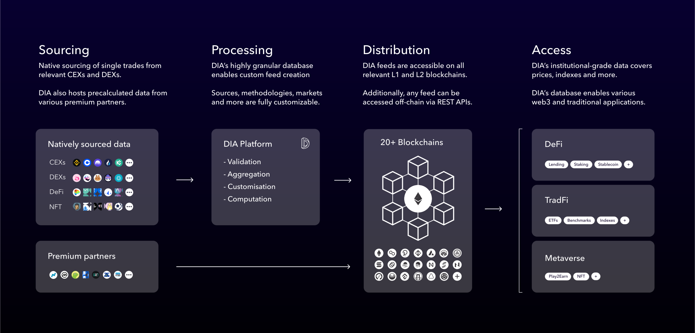

# 🏃 Get Started

## What is DIA?&#x20;

**DIA (Decentralised Information Asset) is a multi-chain, end-to-end, open-source data and oracle platform for Web3.**

The DIA platform enables the sourcing, validation and sharing of transparent and verified data feeds for traditional and digital financial applications. DIA’s institutional-grade data feeds cover asset prices, metaverse data, lending rates and more.

DIA’s data is directly sourced from a broad array of on-chain and off-chain sources at individual a trade-level. This allows DIA feeds to be fully customised with regards to the mix of sources and methodologies, resulting in tailor-made, high resilience feeds, setting a new paradigm for oracles.

Links: [Homepage](https://diadata.org/) | [Medium Blog](https://medium.com/dia-insights) | [Github](https://github.com/diadata-org) | [Twitter](https://twitter.com/DIAdata\_org) | [Discord](https://discord.gg/zFmXtPFgQj) | [Telegram](https://t.me/DIAdata\_org)

 

## The DIA Ecosystem

DIA is an open-source ecosystem for financial data. The aim of DIA is to make transparent, accurate and verifiable data accessible for Web3, by bringing together data providers, users and DAO community members.

<mark style="color:blue;">**Data sources:**</mark> every second, thousands of trade level data points from multiple on-chain and off-chain sources (CEXs, DEXs, DeFi, NFT, Metaverse, etc) are aggregated into the DIA Platform.

<mark style="color:blue;">**DIA Open-Source Platform:**</mark>

* **Open Contributors**: to collect the data, an open community of developers build scrapers to connect new data sources with the DIA open-source platform.
* **Governors/validators:** a community of token holders discuss and vote to improve the platform; crowd-approve and validate features and govern the DIA Association.
* **Off-chain computation:** the ingested raw data is computed and sanitised based on fully transparent methodologies to avoid temporary off-data and outliers.&#x20;

<mark style="color:blue;">**Blockchains**</mark><mark style="color:blue;">:</mark> new data points are shipped via API or dedicated oracle smart contracts and made available to developers in 25+ layer 1 and layer 2 blockchain networks.

<mark style="color:blue;">**dApps:**</mark> DIA oracles are easy to integrate into smart contracts to power a broad range of DeFi, TradFi and Metaverse use cases, such as lending, lending, staking or stablecoins.

## DIA's data offering

### <mark style="color:blue;">Data categories</mark>

DIA's crowd-sourcing approach to data sourcing uniquely positions DIA to utilise the broadest possible set of sources and ensure maximum coverage of asset price data. Any data feed that is publicly accessible can be sourced, regardless of whether it is listed on exchanges and what its trading volume is - there is no dependency on third-party data providers.&#x20;

Here is a high-level overview of DIA's data offering:

### <mark style="color:blue;">Data sources</mark>

By leveraging a community of developers and a distributed network of nodes, DIA scrapes, collects and aggregates data directly from multiple on-chain sources or Centralised Exchange APIs at individual trade levels.&#x20;

Here is a high-level overview of data sources DIA leverages:

### <mark style="color:blue;">Delivery methods</mark>

DIA enables users to select how they ingest data using multiple delivery methods present on a constantly growing L1 / L2 ecosystem, powered by a network of strong industry partners.

#### **On-chain delivery | DIA xNode**

Oracles can be customised to trigger updates based on:

* **Request**: updates are triggered via a dedicated smart contract or API call.
* **Time**: updates are triggered in predefined time intervals
* **Deviation**: updates are triggered by a deviation from the last reported value

#### **Off-chain delivery  | DIA xBase**

&#x20;Data can be delivered off-chain via

* **Rest API**: delivers data feeds in a predefined, standardised format
  * **Update frequency**: 120s
  * **Methodology**: [MAIR](documentation/methodology/digital-assets/exchangeprices/mair-moving-average-with-interquartile-range-filter.md)
  * **Sources**: [all available](documentation/data-sources/natively-sourced-data.md)
* **GraphQL**: enables more flexibility and direct adjustments of feed attributions
  * **Update frequency**: custom
  * **Methodology**: custom
  * **Sources**: custom

## Contribute

DIA through its DAO operations is working towards building the biggest open-source data platform of Web3. To reach this goal, DIA leverages the power of communities and decentralisation on many levels to scale its product development and growth.&#x20;

Contribute to the DAO through the two verticals below:


[product-development.md](contribute/product-development.md)



[ecosystem-growth.md](contribute/ecosystem-growth.md)


## Support


[discord.md](support/discord.md)



[request-a-custom-oracle.md](support/request-a-custom-oracle.md)


