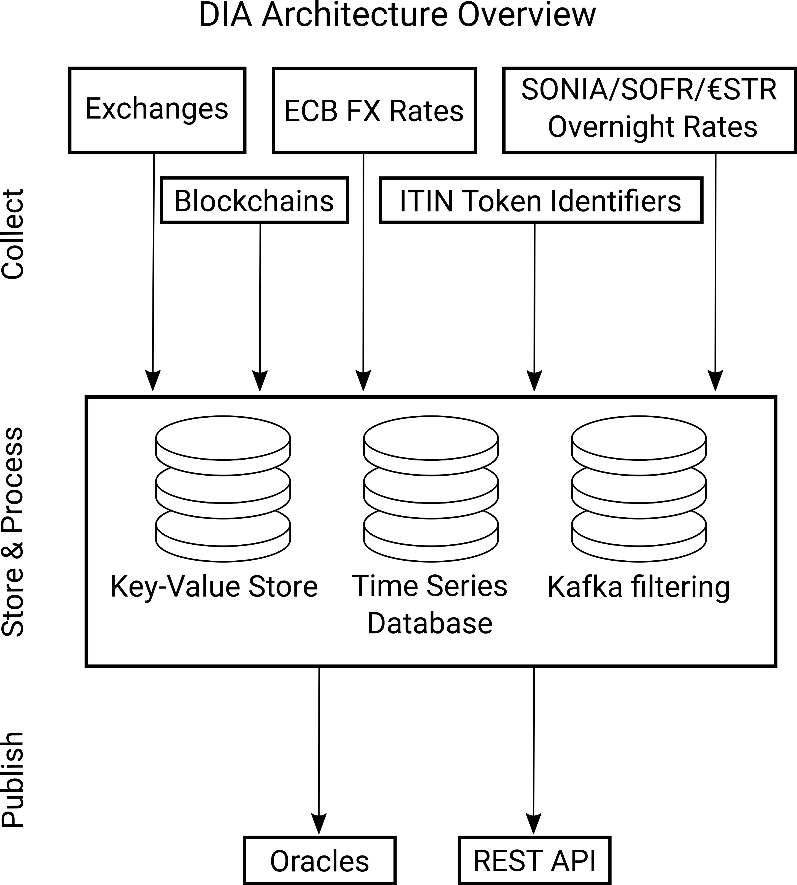

# Documentation

Welcome to the [DIAdata.org](https://diadata.org) platform. DIA is an ecosystem for open financial data in a financial smart contract ecosystem. The target of DIA is to bring together data analysts, data providers and data users. In general, DIA provides a reliable and verifiable bridge between off-chain data from various sources and on-chain smart contracts that can be used to build a variety of financial dApps.&#x20;

DIA is divided into three main building blocks. First, our data collection mechanisms scrape and source data from various sources. Second, our database layer is flexible to handle all different kinds of data streams, from high frequency trading APIs to data that is never changed and accessible in a high-performance key-value-store. Lastly, the collected and aggregated is distributed using our REST API and our oracle system.

## How to Use


[tutorials](tutorials/)



[methodology](methodology/)


## Access Data




[exchangeprices](methodology/digital-assets/exchangeprices/)



[supplynumbers.md](methodology/digital-assets/supplynumbers.md)



[cvi.md](methodology/digital-assets/cvi.md)





[overnight-rates.md](methodology/traditional-assets/overnight-rates.md)




